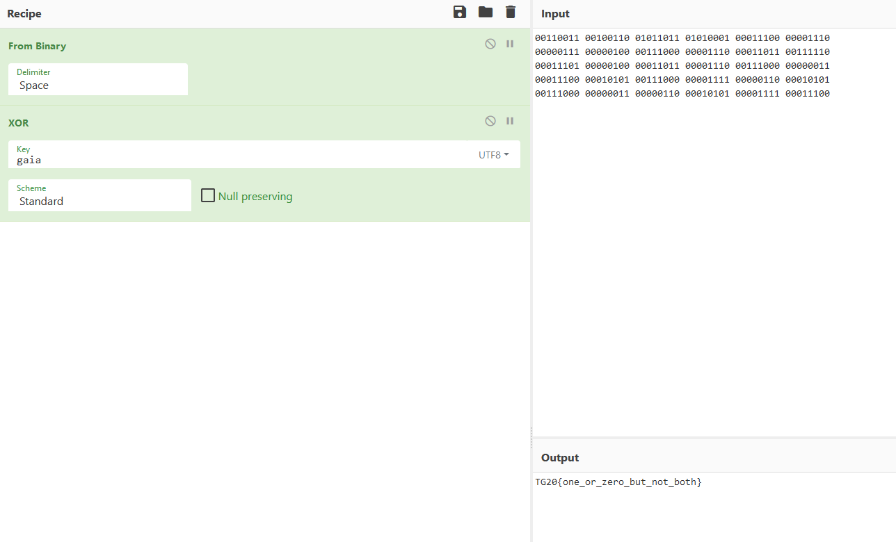

# Writeup - Is This The One? Or Zero?
**Author: Chabz**

**Difficulty: n00b**

**Category: crypto**
___

We are given what appears to be a binary string and the text `gaia`.
Trying to convert the binary string to the corresponding characters only
yields garbage, so it must be encrypted in some way. One of the simplest
ways of encrypting binary is to use the binary operator XOR with a secret
key. Hmm, could `gaia` be the key? Let's try!

When working on tasks like this, I really recommend using [CyberChef](https://gchq.github.io/CyberChef).
We get the flag by setting it up like this:

The flag is `TG20{one_or_zero_but_not_both}`.
