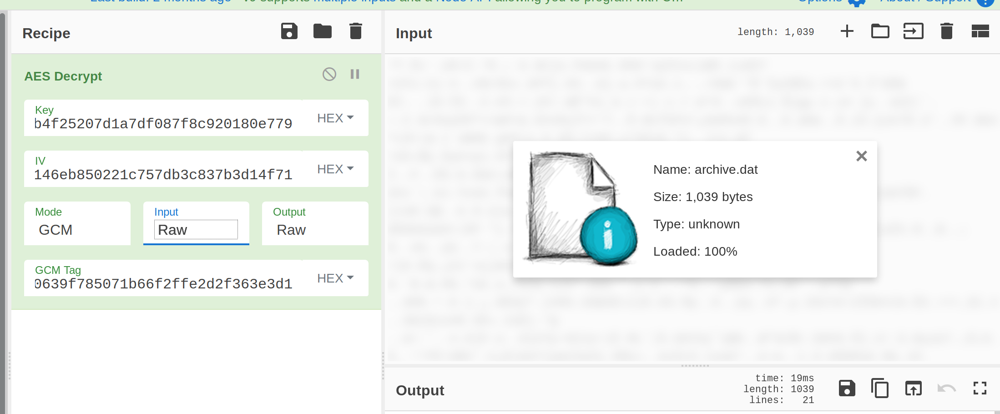

# Writeup - [компрома́т](./README.md)
**Author: Nausicaea**

**Difficulty: hard**

**Category: Forensics/RE**

---

Besides some incredibly funny jokes, our informant suspects that there might be
something else hidden in this old game.

[GAIA Invaders](uploads/gaiainvaders.apk).

<details>
<summary>Hint</summary>
<p> 
Why are there so many files?
</p>
</details>

---

## Writeup
When starting this task, we are given a single downloadable APK file,
`gaiainvanders.apk`.

We download and extract the APK as a ZIP archive
```console
$ exdir = $(mktemp -d)
$ unzip gaiainvaders.apk -d $exdir

Archive:  gaiainvaders.apk
V2VsY29tZSB0byBHQUlBIEludmFkZXJzISBQbGVhc2UgcmVmZXIgdG8geW91ciBjdXJyZW50IG1pc3Npb24gZGV0YWlscyBhcwppbnN0cnVjdGVkIGluIG9yaWVudGF0aW9uLgo=
  inflating: /tmp/tmp.3zpvDAFiir/AndroidManifest.xml
  inflating: /tmp/tmp.3zpvDAFiir/META-INF/CERT.RSA
  ...
  inflating: /tmp/tmp.3zpvDAFiir/META-INF/kotlin-stdlib.kotlin_module
 extracting: /tmp/tmp.3zpvDAFiir/assets/archive.0000.dat
 extracting: /tmp/tmp.3zpvDAFiir/assets/archive.0001.dat
 extracting: /tmp/tmp.3zpvDAFiir/assets/archive.0002.dat
 extracting: /tmp/tmp.3zpvDAFiir/assets/archive.0003.dat
 extracting: /tmp/tmp.3zpvDAFiir/assets/archive.0004.dat
 extracting: /tmp/tmp.3zpvDAFiir/assets/archive.0005.dat
 extracting: /tmp/tmp.3zpvDAFiir/assets/archive.0006.dat
 extracting: /tmp/tmp.3zpvDAFiir/assets/archive.0007.dat
 extracting: /tmp/tmp.3zpvDAFiir/assets/archive.0008.dat
 extracting: /tmp/tmp.3zpvDAFiir/assets/archive.0009.dat
 extracting: /tmp/tmp.3zpvDAFiir/assets/archive.0010.dat
 extracting: /tmp/tmp.3zpvDAFiir/assets/archive.0011.dat
 extracting: /tmp/tmp.3zpvDAFiir/assets/archive.0012.dat
 extracting: /tmp/tmp.3zpvDAFiir/assets/archive.0013.dat
 extracting: /tmp/tmp.3zpvDAFiir/assets/archive.0014.dat
 extracting: /tmp/tmp.3zpvDAFiir/assets/archive.0015.dat
 ...
```

The output of the archive extraction should already show us that there are lots
and lots of files in the APK. What particularly catches the eye is that the
directory `/assets` contains exactly 1024 files with names like
`archive.xxxx.dat`. But something else shows up as well! We get a Base64
encoded string right at the top, that translates to

```console
$ echo "V2V...Lgo=" | base64 -d

Welcome to GAIA Invaders! Please refer to your current mission details as
instructed in orientation.
```

Nice. Okay, apparently this is not just a game but there are mission details or
even orders hidden somewhere. They are probably within those archive files.

Most of those files, by far, are completely empty and all the rest are equal in
size. Given the names of the files, somebody must have split up some data into
multiple files. Let's concatenate those and see what the contents looks like.

```console
$ cat $exdir/assets/archive.*.dat > $exdir/archive.dat
$ hexdump -C $exdir/archive.dat | less

00000000  b3 66 09 d5 ab a8 0b f9  c3 2b cf 0b b3 c3 2e a1  |.f.......+......|
00000010  a0 eb 7f e3 43 7d 65 0c  50 41 62 47 6b 98 52 f1  |....C}e.PAbGk.R.|
00000020  4b b9 4a 70 cf 56 76 63  ef d8 d2 91 ec b1 e2 dc  |K.Jp.Vvc........|
00000030  3f 3c f3 dd 7a 3a 32 6a  b7 23 9d 13 6e b6 72 f0  |?<..z:2j.#..n.r.|
00000040  f3 bb 02 f6 50 66 5b 01  f5 f6 17 0c 6d 5d 7f 61  |....Pf[.....m].a|
00000050  96 f1 3f fa f6 89 ef 90  0f 1f 2f 48 e3 4b 60 2a  |..?......./H.K`*|
00000060  d5 a8 cf 79 c7 b6 c8 61  89 3d d7 55 a8 f5 84 cf  |...y...a.=.U....|
00000070  b2 e2 d4 26 cb cd 87 1b  0e 29 30 3a ce c0 09 0a  |...&.....)0:....|
00000080  58 0f 6b f1 0f 3e 08 7b  4b 5c 9a 57 ca 2a 35 31  |X.k..>.{K\.W.*51|
00000090  5f be 1a ab b7 3c 7c 8a  63 8a 72 04 6d b9 d3 04  |_....<|.c.r.m...|
...
```

All we get is what looks like 1 kilobytes of random binary data, with no header
or anything. This looks like it might have been encrypted. Might we find the
key somewhere else in the archive?

Let's look at the APK again, this time in a hexdump. We know, that APK files
are mostly ZIP archives, so the Wikipedia page on the ZIP file format informs
us that they start with the magic bytes `50 4b 03 04`, and little-endian byte
order is used. Additionally the actual ZIP header, the so-called *Central
Directory*, is at the end of the file and it contains a directory of all files
stored in the archive.

```console
$ hexdump -C gaia-invaders.apk | less

00000000  50 4b 03 04 00 00 00 00  08 00 00 00 00 00 df f6  |PK..............|
00000010  75 59 a1 03 00 00 70 0b  00 00 13 00 00 00 41 6e  |uY....p.......An|
00000020  64 72 6f 69 64 4d 61 6e  69 66 65 73 74 2e 78 6d  |droidManifest.xm|
00000030  6c ad 55 4b 4f 53 41 14  3e d3 4b 6d a1 94 f7 9b  |l.UKOSA.>.Km....|
00000040  f2 50 40 89 ca 45 13 17  c6 1d 82 08 06 59 60 74  |.P@..E.......Y`t|
...
0035c1e0  6e 63 68 65 72 5f 72 6f  75 6e 64 2e 70 6e 67 50  |ncher_round.pngP|
0035c1f0  4b 01 02 00 00 00 00 00  00 00 00 00 00 00 00 20  |K.............. |
0035c200  89 4b a7 88 39 04 00 88  39 04 00 0e 00 00 00 00  |.K..9...9.......|
0035c210  00 00 00 00 00 00 00 80  01 46 44 2f 00 72 65 73  |.........FD/.res|
0035c220  6f 75 72 63 65 73 2e 61  72 73 63 50 4b 05 06 00  |ources.arscPK...|
0035c230  00 00 00 f8 06 f8 06 31  44 02 00 fa 7d 33 00 88  |.......1D...}3..|
0035c240  00 56 32 56 73 59 32 39  74 5a 53 42 30 62 79 42  |.V2VsY29tZSB0byB|
0035c250  48 51 55 6c 42 49 45 6c  75 64 6d 46 6b 5a 58 4a  |HQUlBIEludmFkZXJ|
0035c260  7a 49 53 42 51 62 47 56  68 63 32 55 67 63 6d 56  |zISBQbGVhc2UgcmV|
0035c270  6d 5a 58 49 67 64 47 38  67 65 57 39 31 63 69 42  |mZXIgdG8geW91ciB|
0035c280  6a 64 58 4a 79 5a 57 35  30 49 47 31 70 63 33 4e  |jdXJyZW50IG1pc3N|
0035c290  70 62 32 34 67 5a 47 56  30 59 57 6c 73 63 79 42  |pb24gZGV0YWlscyB|
0035c2a0  68 63 77 70 70 62 6e 4e  30 63 6e 56 6a 64 47 56  |hcwppbnN0cnVjdGV|
0035c2b0  6b 49 47 6c 75 49 47 39  79 61 57 56 75 64 47 46  |kIGluIG9yaWVudGF|
0035c2c0  30 61 57 39 75 4c 67 6f  3d                       |0aW9uLgo=|
0035c2c9
```

In the hexdump, we find both the beginning magic bytes and the Central
Directory at the end of the file, concluded by the Base64 string we decoded
earlier. 

We know that each Central Directory entry starts with the magic bytes `50 4b 01
02`, and a typical Central Directory entry looks like the following:

```
00337df0  03 7f 08 00 00 05 21 3d  aa 01 50_4b_01_02 00 00  |......!=..PK....|
00337e00  00 00 00 00 08 00 00 00  00 00 df f6 75 59 a1 03  |............uY..|
00337e10  00 00 70 0b 00 00 13 00  00 00 00 00 00 00 00 00  |..p.............|
00337e20  00 00 80 01 00 00 00 00  41 6e 64 72 6f 69 64 4d  |........AndroidM|
00337e30  61 6e 69 66 65 73 74 2e  78 6d 6c 50_4b_01_02 18  |anifest.xmlPK...|
```

Apart from the file name and ZIP-specific data about where to find the
compressed file data, not much interesting is to be found. But when we look at
the first 30 `archive.XXXX.dat` files, we see more. There is some data that
looks suspiciously like Base64 data.

```
00338cf0  6e 5f 6d 6f 64 75 6c 65  50_4b_01_02 18 00 0a 00  |n_modulePK......|
00338d00  00 00 00 00 00 00 00 00  9a 35 a0 5c 1c 00 00 00  |.........5.\....|
00338d10  1c 00 00 00 17 00 10 00  00 00 00 00 00 00 00 00  |................|
00338d20  80 01 fc 4a 01 00 61 73  73 65 74 73 2f 61 72 63  |...J..assets/arc|
00338d30  68 69 76 65 2e 30 30 30  30 2e 64 61 74 37 13 0c  |hive.0000.dat7..|
00338d40  00 43 69 4d 6a 49 79 42  43 52 55 64 4a 50_4b_01_ |.CiMjIyBCRUdJPK.|
```

Since the files `archive.0031.dat` and up don't contain any strange metadata
anymore, and the file `archive.0030.dat` has metadata that ends with an `=`
after a few letters, we can assume that this is one long Base64 string split up
across multiple Central Directory records. The Wikipedia page on the ZIP file
format informs us that this data resides in the so-called Extra field, where
third parties may store file-specific metadata in the Central Directory
records. Each Extra field is formatted as follows:

```
Header ID (two bytes) : Data Length (two bytes) : Data
```

Looking at the Extra fields of the first 30 `archive.XXXX.dat` files, we see
that every field starts with the bytes `37 13 0c 00` and ends with some string
data. Since the data is encoded in little-endian order, the first two bytes
(ie. the header ID) translate to `1337`, which is a suspicious number. Somebody is
definitely hiding something here. And the second two bytes translate to a data
length of 13, so we know now that same as with the contents of the
`archive.XXXX.dat` files, the data in the Extra fields is distributed in
equal-length chunks.

Because parsing binary files by hand is a pain, let's use the Python `zipfile`
package to do the job for us.

```python
#!/usr/bin/env python3
# -*- coding: utf-8 -*-

import sys
import base64
import struct
from pathlib import Path
from zipfile import ZipFile, ZipInfo

if len(sys.argv) > 1:
    source_path = Path(sys.argv[1])
else:
    source_path = Path('gaia-invaders.apk')

with ZipFile(source_path, mode='r') as s:
    # Grab the ZipInfo objects only for those files we are interested in,
    # then sort the list
    source_infos = list(sorted(s.infolist(), key=lambda i: i.filename))

    # Since we are only interested in files whose Extra fields have the header
    # ID 1337, we need to convert that number to binary representation first.
    header_id_packed = struct.pack('<H', 0x1337)

    # Parse the Extra field for every relevant file
    extra_fields = list()
    i = 0
    for z in source_infos:
        # Skip any uninteresting files
        if not (len(z.extra) > 0 and z.extra.startswith(header_id_packed)):
            continue

        # Retrieve the extra field by first reading the data length, and then
        # parsing the binary data into python
        (_, length) = struct.unpack('<2H', z.extra[:4])
        (extra_field, ) = struct.unpack(f'<{length}s', z.extra[4:4+length])

        extra_fields.append(extra_field)

    # Join the bytes from each extra field into one long string
    joined_raw_b64_payload = bytes((b for ef in extra_fields for b in ef))
    extra_field_data = base64.b64decode(joined_raw_b64_payload)
    print(extra_field_data.decode('ascii'))
```

When we run the script across the APK file, we get gold! We have found the
encryption keys, and they're even so nice as to tell us which cipher they used.

```console
$ python3 extra-fields.py

### BEGIN AES-128-GCM KEY ###
c0b4f25207d1a7df087f8c920180e779
### END AES-128-GCM KEY ###
### BEGIN AES-128-GCM IV ###
f8146eb850221c757db3c837b3d14f71
### END AES-128-GCM IV ###
### BEGIN AES-128-GCM TAG ###
ea0639f785071b66f2ffe2d2f363e3d1
### END AES-128-GCM TAG ###
```

Since we already have something we could try to decrypt, let's open up
CyberChef and enter those deets! As input, we upload the joined `archive.dat`
binary file, And for the recipe we try a simple `AES Decrypt` block with the
credentials from our Extra field data, as shown in the picture below.



And we got it! The resulting flag should be `TG20{unification_is_holy_and_inevitable}`.
