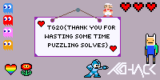

# Writeup [Space puzzles](./README.md)

## Task description
**Author: maritio_o**

**Difficulty: challenging** 

**Category: misc** 

---

Nani?! What are these strange puzzles? Can you solve them?

```
nc puzzle.tghack.no 7002
```

---

## Writeup
In this task, all we get is the URL and port to connect to. Using netcat to
connect, prints the following:
```console
Starting level 1....
---START---
20 30

Puzzle:
-------------------------------------------------------------------------------------------
          |                                              4                                |
          |                                              1 4                              |
          |                    5 10                     4 3 1   4         5 3              |
          |          10 9 11   12 1 5     14 14       5 4   1 4 1 4 1 4 4     8 9              |
          |        11 3 9 2 14 2 8 2 16 15 3 3 13 12 12 3 4 4 2 3 1 1 3 1 1 4 4 1 1              |
          |30 30 30 30 18 15 10 9 11 10 9 5 7 3 3 3 7 6 3 3 3 9 12 3 11 16 12 16 16 18 18 7 14 30 30 30 30 30 30 30|
-------------------------------------------------------------------------------------------
        40|                                                                               |
        40|                                                                               |
        40|                                                                               |
      32 7|                                                                               |
      20 9|                                                                               |
    10 8 8|                                                                               |
    19 1 8|                                                                               |
    10 8 8|                                                                               |
      19 8|                                                                               |
    6 12 8|                                                                               |
   5 5 7 8|                                                                               |
  4 2 11 8|                                                                               |
  7 1 7 17|                                                                               |
   7 8 3 7|                                                                               |
  5 1 5 17|                                                                               |
 7 3 2 7 7|                                                                               |
      7 18|                                                                               |
    7 1 13|                                                                               |
    8 2 15|                                                                               |
    6 2 18|                                                                               |
   7 2 9 8|                                                                               |
     11 19|                                                                               |
  12 3 7 8|                                                                               |
   13 3 21|                                                                               |
 11 1 4 21|                                                                               |
   13 4 21|                                                                               |
 13 2 2 16|                                                                               |
        40|                                                                               |
        40|                                                                               |
        40|                                                                               |
-------------------------------------------------------------------------------------------

Only send me the grid. It needs the same borders.
End with new line containing 'EOF'
```

Have you seen this puzzle before? This type of puzzle has many names, but is 
most commonly known as "Nonogram" or "Picross". You may find the name by 
googling

Finding a solver for this type of problem, applying it to solve the puzzle and
sending it back results in another puzzle. We can safely assume that we are 
going to receive ton's of these puzzles since it is a misc programming task.
Therefore it is best to send the solution back by writing a solution script.

A good practice while scripting these solutions, is to use a `try/catch` or 
`try/except`. Whenever we don't get the expected output, our script will hit
the `except` statement. This way, we can make the script go into interactive
mode when something fails. That means it you can do manual actions. Look at
the [solve script](./src/solve.py) for examples. 

Now, we see that the numbers in the first line matches with height and width of 
the grid. So, we can assume that we know the size of each solution grid. We
use this information to parse the puzzle. 

Following the rules of Nonogram, we generate the following grid: 
```console
---------------------------------------------------------------------------------
|X X X X X X X X X X X X X X X X X X X X X X X X X X X X X X X X X X X X X X X X|
|X X X X X X X X X X X X X X X X X X X X X X X X X X X X X X X X X X X X X X X X|
|X X X X X X X X X X X X X X X X X X X X X X X X X X X X X X X X X X X X X X X X|
|X X X X X X X X X X X X X X X X X X X X X X X X X X X X X X X X   X X X X X X X|
|X X X X X X X X X X X X X X X X X X X X                       X X X X X X X X X|
|X X X X X X X X X X   X X X X X X X X                           X X X X X X X X|
|X X X X X X X X X X X X X X X X X X X       X                   X X X X X X X X|
|X X X X X X X X X X   X X X X X X X X                           X X X X X X X X|
|X X X X X X X X X X X X X X X X X X X                           X X X X X X X X|
|X X X X X X   X X X X X X X X X X X X                           X X X X X X X X|
|X X X X X   X X X X X   X X X X X X X                           X X X X X X X X|
|X X X X   X X   X X X X X X X X X X X                           X X X X X X X X|
|X X X X X X X   X   X X X X X X X             X X X X X X X X X X X X X X X X X|
|X X X X X X X   X X X X X X X X                           X X X   X X X X X X X|
|X X X X X   X     X X X X X                   X X X X X X X X X X X X X X X X X|
|X X X X X X X       X X X                   X X   X X X X X X X   X X X X X X X|
|X X X X X X X                               X X X X X X X X X X X X X X X X X X|
|X X X X X X X                                     X   X X X X X X X X X X X X X|
|X X X X X X X X                             X X   X X X X X X X X X X X X X X X|
|X X X X X X   X X                           X X X X X X X X X X X X X X X X X X|
|X X X X X X X   X X                         X X X X X X X X X   X X X X X X X X|
|X X X X X X X X X X X                     X X X X X X X X X X X X X X X X X X X|
|X X X X X X X X X X X X                 X X X   X X X X X X X   X X X X X X X X|
|X X X X X X X X X X X X X   X X X     X X X X X X X X X X X X X X X X X X X X X|
|X X X X X X X X X X X   X   X X X X   X X X X X X X X X X X X X X X X X X X X X|
|X X X X X X X X X X X X X   X X X X   X X X X X X X X X X X X X X X X X X X X X|
|X X X X X X X X X X X X X       X X       X X   X X X X X X X X X X X X X X X X|
|X X X X X X X X X X X X X X X X X X X X X X X X X X X X X X X X X X X X X X X X|
|X X X X X X X X X X X X X X X X X X X X X X X X X X X X X X X X X X X X X X X X|
|X X X X X X X X X X X X X X X X X X X X X X X X X X X X X X X X X X X X X X X X|
---------------------------------------------------------------------------------
```

Now, to send it back it must contain a new line with EOF, like below:
```console
---------------------------------------------------------------------------------
|X X X X X X X X X X X X X X X X X X X X X X X X X X X X X X X X X X X X X X X X|
|X X X X X X X X X X X X X X X X X X X X X X X X X X X X X X X X X X X X X X X X|
|X X X X X X X X X X X X X X X X X X X X X X X X X X X X X X X X X X X X X X X X|
|X X X X X X X X X X X X X X X X X X X X X X X X X X X X X X X X   X X X X X X X|
|X X X X X X X X X X X X X X X X X X X X                       X X X X X X X X X|
|X X X X X X X X X X   X X X X X X X X                           X X X X X X X X|
|X X X X X X X X X X X X X X X X X X X       X                   X X X X X X X X|
|X X X X X X X X X X   X X X X X X X X                           X X X X X X X X|
|X X X X X X X X X X X X X X X X X X X                           X X X X X X X X|
|X X X X X X   X X X X X X X X X X X X                           X X X X X X X X|
|X X X X X   X X X X X   X X X X X X X                           X X X X X X X X|
|X X X X   X X   X X X X X X X X X X X                           X X X X X X X X|
|X X X X X X X   X   X X X X X X X             X X X X X X X X X X X X X X X X X|
|X X X X X X X   X X X X X X X X                           X X X   X X X X X X X|
|X X X X X   X     X X X X X                   X X X X X X X X X X X X X X X X X|
|X X X X X X X       X X X                   X X   X X X X X X X   X X X X X X X|
|X X X X X X X                               X X X X X X X X X X X X X X X X X X|
|X X X X X X X                                     X   X X X X X X X X X X X X X|
|X X X X X X X X                             X X   X X X X X X X X X X X X X X X|
|X X X X X X   X X                           X X X X X X X X X X X X X X X X X X|
|X X X X X X X   X X                         X X X X X X X X X   X X X X X X X X|
|X X X X X X X X X X X                     X X X X X X X X X X X X X X X X X X X|
|X X X X X X X X X X X X                 X X X   X X X X X X X   X X X X X X X X|
|X X X X X X X X X X X X X   X X X     X X X X X X X X X X X X X X X X X X X X X|
|X X X X X X X X X X X   X   X X X X   X X X X X X X X X X X X X X X X X X X X X|
|X X X X X X X X X X X X X   X X X X   X X X X X X X X X X X X X X X X X X X X X|
|X X X X X X X X X X X X X       X X       X X   X X X X X X X X X X X X X X X X|
|X X X X X X X X X X X X X X X X X X X X X X X X X X X X X X X X X X X X X X X X|
|X X X X X X X X X X X X X X X X X X X X X X X X X X X X X X X X X X X X X X X X|
|X X X X X X X X X X X X X X X X X X X X X X X X X X X X X X X X X X X X X X X X|
---------------------------------------------------------------------------------
EOF
```

Alright, cool. This gives me another puzzle. So our assumption was right about
getting more puzzles:
```console
Yatta~~ Kawaii nonogram*\(^_^ )/*

---START---
20 16

Puzzle:
---------------------------------------------------------------------------------------
      |                        1 3           6                 6           3 1        |
      |15 17 21 22 23 24 24 25 25 25 25 25 25 25 30 30 30 30 28 3 25 23 22 21 21 22 23 25 3 28 30 30 30 30 25 25 25 25 25 25|
---------------------------------------------------------------------------------------
   6 6|                                                                               |
   5 5|                                                                               |
   6 6|                                                                               |
   5 5|                                                                               |
   6 6|                                                                               |
 14 13|                                                                               |
 16 13|                                                                               |
 18 14|                                                                               |
 20 15|                                                                               |
    38|                                                                               |
17 8 11|                                                                               |
17 8 11|                                                                               |
17 8 11|                                                                               |
18 8 11|                                                                               |
18 8 11|                                                                               |
19 8 11|                                                                               |
19 8 11|                                                                               |
19 8 11|                                                                               |
19 8 11|                                                                               |
19 8 11|                                                                               |
19 8 11|                                                                               |
19 8 11|                                                                               |
19 8 11|                                                                               |
19 8 11|                                                                               |
19 8 11|                                                                               |
19 8 11|                                                                               |
19 8 11|                                                                               |
    40|                                                                               |
    40|                                                                               |
    40|                                                                               |
---------------------------------------------------------------------------------------

Only send me the grid. It needs the same borders.
End with new line containing 'EOF'

```

I used [this](https://github.com/Izaron/Nonograms) Nonogram solver to solve the
puzzles. It uses a file format called `.pzl`. That mean I do the following to
solve puzzle and send back:

1. parse terminal output into .pzl format
2. send .pzl file into solver
3. generate expected terminal input and send to server

Doing this until the except hits, you will see that you've solved level 1. For
level 2, you have to deal with colors as well :O.

This is basically the same thing. The .pzl format has support for colors as well,
so following the same format should do the trick! 

Solving level 2 outputs:
```console
Level 2 finished! Ready for Level 3? 3D puzzles!!!
READY? Y/n: Y
lol jk <3
Did you checkout the latest picture? :)
```

So the latest image you sent contains the flag!



```
TG20{THANK YOU FOR WASTING SOME TIME PUZZLING SOLVES}
```

Look at the (terrible) solution script in [/src/solve.py](./src/solve.py).

Disclaimer: My solve script is kind of crap, added [sampriti's solutuion script](./src/sampriti_solve.py).
