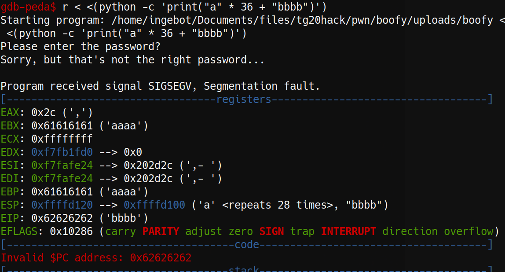

# Writeup - Boofy 
**Author: Ingeborg**

**Difficulty: easy**

**Category: pwn**

---

By looking at boofy.c, it's clear that the end goal is to reach the
get_flag-function. We don't have any way of doing this through normal input
But the gets-function is vulnerable to buffer overflows, so all we need is to
find the address of get_flag. We can then return from try_password into
get_flag.

We can find the address of get_flag in gdb by writing print gdb. It can also
be found with readelf like so:
```console
$ readelf -s boofy | grep get_flag
53: 08048486    43 FUNC    GLOBAL DEFAULT   14 get_flag
```

Now we just need to know how much padding to use. In order to find this number,
we can start by looking at the size of the buffer we want to overflow. In our 
case the it's size is 20 bytes, so we know we need at least 20 bytes of 
padding. In addition we need another 4 bytes to cover the base pointer (marking
the base of the current stack frame). The compiler may also add up to 15 filler
bytes between the first buffer and the register values. This is so that the 
stack is aligned to 16. 

   


In the image above we see that the program failed when trying to return to 
"0x62626262". This is the hex value of "bbbb", which is not an area containing
valid instructions. Because we put 36 bytes of the character "a" before the 
four "b"s, we know that this is the amount of padding needed before we can 
overwrite the return address. Another important note is that in order for 
the program to receive the the data correctly, we need to write it "backwards"
in little endian. Read more about endianness [here](https://en.wikipedia.org/wiki/Endianness):
```console
$ python -c 'print("a" * 36 + "\x86\x84\x04\x08")' | ./boofy
```

In order to get the real flag, we need to send this data to the server.
This can be done by replacing "./boofy" with "nc boofy.tghack.no 6003"

---
