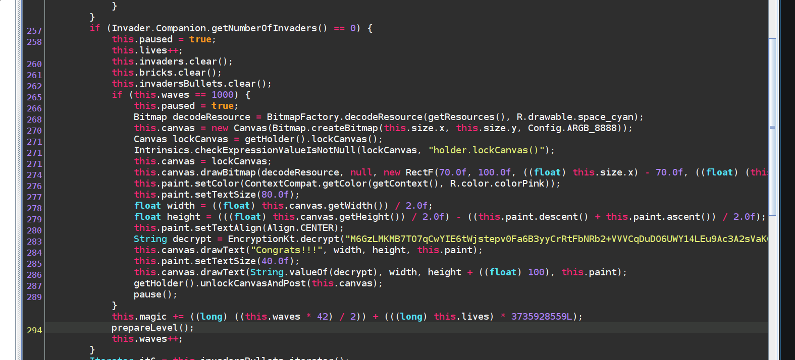

# Writeup [Chuck Norris](./README.md)

# Chuck Norris
**Author: maritio_o**

**Difficulty: easy/challenging**

**Category: RE**

---

Ha-ha! Did you like the joke from the previous challenge? Here, have another
one:
```
Chuck Norris once won a game of Space Invaders without shooting.
```

* [Gaia Invaders APK](uploads/gaiainvaders.apk).

---

## Writeup
You get an APK file, which is the file type of Android mobile apps. Now, there
is a hint in the joke, "win the game without shooting". How do we win the game
without shooting? We patch the APK!

Patching an APK resolves in the following steps:
1. Decompile APK (we will do it with apktool)
2. Make changes to the Smali code
3. Rebuild the app
4. Install and run new APK

### Step 1: Decompile APK with apktool
Run the following command:
```
apktool d gaiainvaders.apk
```

A new folder should be added in your folder. It contains lots of Smali code.
Smali can be compared to Assembly code. Let's call it mobile app assembly code.

### Step 2: Make changes to the Smali code
Smali code can be tiresome to read, so it is probably a good idea to 
decompile your app to Java code as well. You will not be able to modify the
Java code, but it is easier to reverse engineer. I use 
[jadx-gui](https://github.com/skylot/jadx) for this:
```
jadx-gui gaiainvaders.apk
```

By looking at the decompiled code in the `GaiaInvadersView.kt` file, we can see that
we have to win a thousand games to decrypt a bonus message. The message is decrypted
in the `Encryption.kt` file. Without going into too many details, we have two choices here:

1. Patch the APK to win a 1000 times
2. Reverse engineer the encryption and decrypt the message

The simplest one is to patch the APK, so if you choose to reverse the cryptography, 
shame on you! Haha no, whatever, either way you should enjoy your flag! In this
writeup, we focus on how to patch the APK. 

There is especially one part of the code that is interesting, it is shown in the
screenshot below. What we see is an _if statement_ that checks whether there are zero
Gaia Invaders left on the map. We proceed by assuming that having zero invaders on 
the map is equal to winning the current level, or wave which it is called in Gaia
Invaders. 



Next, we see another if statement that decrypts a ciphertext if we clear 1000 waves. 
Underneath this second if statement, at line 295, we see that the wave is increased by one.
This proves our assumption above to be right.

On line 293 we see some weird stuff that we would only bother understanding if we would 
solve this the hard way. It is merely some obfuscation to make it a little harder to reverse
the crypto than patching the APK. Although, it is important for us to understand that we 
can _not_ modify this part of the code because it is needed for the decryption to work. 
Also, since it used values that change based on each wave, we cannot change the amount of 
waves either. We must win a thousand waves. 

To do that, we patch the following parts:

1. Make the first if statement always return true. Then the game will think that there
are no invaders on the board every time it checks.
2. Remove the `this.paused = true` line or set the value to false as we would have to 
unpause the game a thousand times otherwise.

Aaaand that should be it. Now, let's patch it in the Smali code. I found the right place
in the code by searching for `getNumberOfInvaders` in the `GaiaInvadersView` file. 
We can use that search-string because it is 
used in the first if statement. In Smali, if statements are represented as some sort of 
conditional jump, so the easiest for us is to comment it out using a `#` instead of
making the value become true.

On the next line, we see that the `paused` variable is set, so we comment out this 
one as well. Then we can change the lines as shown in the snippet below:
```
.line 257
:cond_e
sget-object p1, Lno/tghack/gaiainvaders/Invader;->Companion:Lno/tghack/gaiainvaders/Invader$Companion;

invoke-virtual {p1}, Lno/tghack/gaiainvaders/Invader$Companion;->getNumberOfInvaders()I

move-result p1

#if-nez p1, :cond_10

.line 258
#iput-boolean v5, p0, Lno/tghack/gaiainvaders/GaiaInvadersView;->paused:Z
```

Alright, that's it! Head over to the next section to rebuild the app and retrieve 
your flag!

### Step 3: Rebuild app
First step in rebuilding the app is to use apktool:
```
apktool b ./gaiainvaders
```

Rebuilding the app requires having a keystore on your machine. The mobile app
will not allow you to install the rebuilt APK on your emulator/phone without 
signing it first.

To make a keystore, execute the following command. You will be prompted with
some questions. Just leave them empty by pressing `enter`, until you are
prompted with a question asking if the empty (Unknown) values are correct. 
```
keytool -genkey -v -keystore ctf.keystore -alias ctfKeystore -keyalg RSA -keysize 2048 -validity 10000
```

Now that you have a keystore, we can sign the APK:
```
jarsigner -verbose -sigalg SHA1withRSA -digestalg SHA1 -keystore ctf.keystore gaiainvaders/dist/gaiainvaders.apk ctfKeystore
```

Enter the password you made when creating the keystore, and VOILÁ.. Your APK is 
signed!
 
### Step 4: Install and run APK
Install the app. For instance use ADB, as shown below. Or google other ways to
install it.
```
adb install ./gaiainvaders/dist/gaiainvaders.apk
```

If you patched it correctly, you should now start the game, click the mouse to
start it, and wait for the flag. It has to win a thousand waves, so depending on 
your emualator this might take some time.

```
TG20{Norway, the personal space capital of the world}
```
