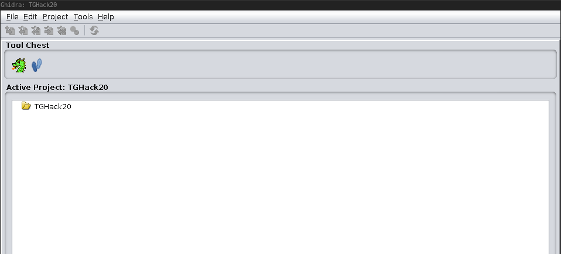

# Introduction

The Combat Ship Reversing Programme contains a series of exercises to prepare 
the Humans for defending against Mother and her minions. In this introduction,
we help you to prepare for the exercises. 

For the programme, you are required to download and install a reverse engineering
tool. We recommend either [IDA Free](https://www.hex-rays.com/products/ida/support/download_freeware.shtml) 
or [Ghidra](https://ghidra-sre.org/). 
All examples are illustrated with Ghidra, so we advice you to choose that one.
Ghidra is a tool that allows you to read the assembly, and also decompiled 
code of software. This way, we may learn what is really going on in 
pieces of software.  

## Download and install Ghidra
This section describes how to download and install Ghidra. Skip this section 
if you already have done so, or if you are using another tool.

You may download a zipped folder at 
[https://ghidra-sre.org/](https://ghidra-sre.org/). Then follow 
[this guide](https://ghidra-sre.org/InstallationGuide.html) on how to install 
Ghidra. 

Note that you must have Java Runtime and Development Kit installed and
set as a path variable. The guide has instructions for this under the 
`Installing Ghidra -> Java Notes` section.

## Open a file in Ghidra
In this section, we show you how to open files in Ghidra to get started. 

First, open Ghidra. 

<details>
<summary>Linux (e.g. Ubuntu)</summary><p>
  
If you are on a Linux machine, go to the folder that
was made upon installing the tool. On my machine, the folder is called
`ghidra_9.0`. And then open Ghidra by running the `ghidraRun` file:
```
$ ./ghidraRun
```
---
</p></details>

You are prompted with a start page. We have to make a "new project" before we
may open any files:
1. Click `File` -> `New Project...`, or simply press `Ctrl + N`.
2. Choose `Non-Shared Project`, click `Next >>`.
3. Find a folder you find suitable to store the files Ghidra generates. It 
does not matter where you put it. However, there are several file that might 
be stored that you probably will want to delete later on, so we recommend
putting it in a folder by itself. 
4. Choose a name, e.g. `TGHack20`, and click `Finish`.

Cool. Now we have a project in Ghidra, as illustrated in the picture below. 



Next step is to open the file:

1. Click `File` -> `Import File...`, or simply press `i`.
2. Choose the file from your file system.
3. You may use `Executable and Linking Format (ELF)` and press `OK`.
4. Another window appears, we don't need any of the information and may click
it away with the `OK` button.

Now, simply click the file. After the fancy animation of the dragon, you are
prompted with a popup saying `[file] has not yet been analyzed. Would you like
to analyze it now?`. Press `Yes`, and then `Analyze`. 

Aaaand VOILÁ! You have opened your first file in Ghidra and is ready to do
some reverse engineering! B)

## Common terms in RE
There are several terms that are nice to understand when doing reverse 
engineering. In this section, we aim towards giving you a brief overview.
Please feel free to let us know if something is missing here, through the 
[contact page](https://tghack.no/page/contact).

| Term | Description |
| ---- | ----------- |
| Reverse engineering | Reverse engineering is to take something apart and figure out how it works. Read more at [Wikipedia](https://en.wikipedia.org/wiki/Reverse_engineering). |
| String | Piece of text. Eg. a sentence. Read more at [Wikipedia](https://en.wikipedia.org/wiki/String_(computer_science)). |
| Assembly language | Assembly is a low level programming language. Read more at [Wikipedia](https://en.wikipedia.org/wiki/Assembly_language). |
| Binary | "A computer program file is one of the most common examples of a binary file."-[Techopedia](https://www.techopedia.com/definition/937/binary-file) Read more: [WhatIs](https://whatis.techtarget.com/definition/binary-file), [webopedia](https://www.webopedia.com/TERM/B/binary_file.html).  |

Just remember that although we gave you lots of reading material, the best
thing you can to do learn loads of cool stuff is to google it yourself!

## Summary
By following this brief introduction, you should have Ghidra or some other 
reverse engineering tool downloaded, and know how to open a file in Ghidra. 
This way, you are ready to start with 
the exercises on the proceeding pages. By reading through the exercises, you 
will gradually learn more and more about reverse engineering. Each page should
help you solve an exam from the [challenges page](link.coming.here).

