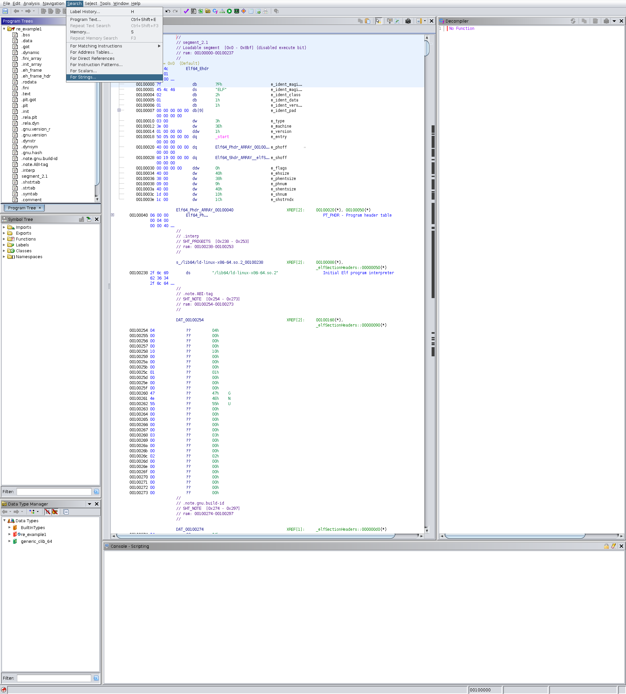
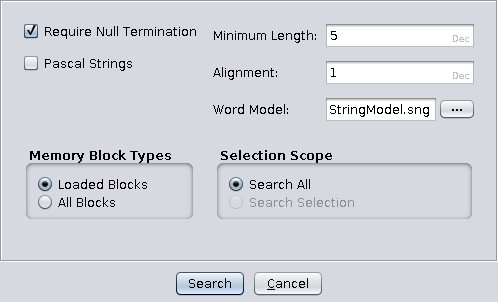

# Combat Ship Reversing Exercise 1: Strings

Welcome to the first exercise of the Combat Ship Reversing Programme. Today,
we go through a very simple trick, finding _strings_ in a binary file. We teach
you this simple trick because we believe it is super important to have it in
your tool belt while hacking your way into Combat Ships, and really any other
software!

By following this tutorial, you will get the flag of the reverse engineering 
challenge called [Combat Ship Reversing Exam 1: Strings](link.til.oppgave).

## Strings
"String" is a word that is often used in programming. Really, a string it is 
just a 
piece of text. What is interesting, is how strings are stored in binary files.
The binary files usually contain lots of jibberish, but the strings are 
maintained and human readable. 

<details>
<summary>What is a binary file?</summary><p>
Binary files. That might be a new term for some of you. So, you know when 
developers are coding. The code they write is not understandable for your 
computer to begin with. 
The programming languages are made for humans to be able to 
interact with the machine. However, before the machine can understand the 
language, the code needs to go through an additional step. That additional
step is that it must be _compiled_ into machine language. 
Think of compiling simply as converting the code to a language that is 
readable by the computer. 
The compilation makes a blob of jibberish, just loads of weird characters. 
This blob is put into a file, which the machine finally understands. That file 
is called a _binary file_. 

E.g. when you open any computer program, like for instance Discord, you run a 
binary file. 

Oh btw. Some programming languages does not get compiled, but that is out of
scope for this tutorial. Google it if you get very curious!!
</p></details>

## Finding strings in Ghidra
Now, let's get started! Take the following binary file:

* [Combat Ship Reversing Exam 1: Strings](re_noob1)

Start by opening the file in Ghidra. 
If you don't have Ghidra, or don't know how to open the file, 
you should go back to the
the introduction page of this tutorial. There, we help you download and 
install the tool, and  
also illustrate how to open Ghidra on a machine running a Linux operating 
system.

This is actually quite simple. We tend to prevent saying that, as everyone
starts from scratch, and everyone learns in different methods and paces. 
However, this time it is really true. When Ghidra has analyzed the file, you 
may go to the navigation bar at the top, and press the `Search` tab. In the 
tab, you proceed by choosing the `For Strings...`. See the example below.



Next, a little window like the following picture will appear. You may 
use the default values; minumum length equals to 5 and alignment equals to one.



Now, we see all the strings in the binary, as in the picture below. 


Do you notice the flag in the third bottom line? It is the little piece of text 
`TG20{I_am_a_dummy_flag_You_may_not_deliver_me}`. As the flag says, it is a
dummy flag. That means it is just used for illustration, and may not be 
delivered in the challenges page to get points. 

This was all for fetching strings. Pretty easy, right? Well that is the reason
why secrets (data others should not see) never should be stored unencrypted
in software. There is an even easier way, which you can read in the next 
section. We showed you this way to get more familiar with Ghidra. 

## Alternative way of finding strings
Now, after showing you how to find strings using Ghidra, we show you an super
simple technique to do the same. This trick will most likely be useful in 
some CTFs. 

In your terminal, go to the directory containing the file you want to find all
strings in. Then use the `strings` command as follows:
```
✗ strings re_example1
```

To provide you with a trick, you may use the `grep` command to check if the 
outputed strings contains a specific piece of text. For instance the static
part of the flag:
```
✗ strings re_example1 | grep "TG20{"
TG20{I_am_a_dummy_flag_You_may_not_deliver_me}
```

<details>
<summary>What is `|` and `grep`?</summary><p>

The `|` sign is called `pipe`. When writing terminal commands, you can chain
commands using a pipe. It takes the output of one command and sends it into
another one.

`grep` searches for a pattern in a file, working directory, or standard input.
If it finds a match, the whole string is printed to the terminal

Let's look at the above command, in which the following is happening:
1. We execute `strings` on the binary, which returns all the strings in that
binary. 
2. The pipe sends the output of the `strings` command as input into the `grep` 
command. 
3. Now, the `grep` command searches through its input (the `strings` results), 
and tries to find the text "TG20{". Any matches are printed to the terminal.

As the flag format starts with "TG20{", you will receive the flag if it exists
as a string in the binary.

We advise you to read about commands you want to learn by googling or using 
the man pages. Read more about the man pages on the `Tips and tools` page.

---

</p></details>

As a fun fact, sometimes, CTF authors forget to check the strings of a task. 
Then a task that is supposed to be very hard might turn out to be very easy. 

## Summary
In this class, we showed you two ways of fetching strings from a binary file,
within Ghidra and by using the terminal command `strings`. With this knowledge,
we found the flag of a challenge. You may find it in the _Challenges page_:

* [Combat Ship Reversing Exam 1: Strings](link.til.oppgave)

Good luck, my young Padawan!
