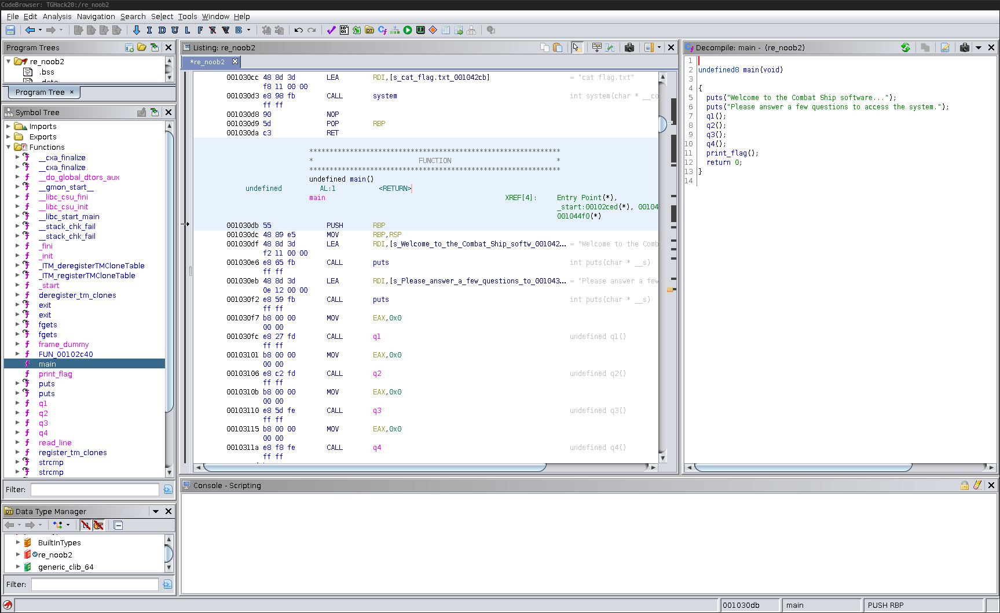

# Combat Ship Reversing Exercise 3: Tracing strings with Ghidra

In this class of Combat Ship Reverse Engineering, we are going to dive into
how we may trace a program's flow and find `if statements`. We use the 
knowledge about if statements from the previous tutorial to do some static
reverse engineering in Ghidra. 

As in the previous tutorial, you will learn how to find a program's expected 
input, in order to enter the correct answer of all the questions. Wrong answers 
make the program exit. Entering the right answers let's the program continue 
until the flag is outputted. However, using `ltrace` will not work this time!
We have to do some static analysis using Ghidra to find the right answers. 

To make it just a little more challenging to you, the illustrations in this 
tutorial uses the binary from the previous tutorial. You will have to do the
actual reversing on the new binary to get the flag. Remember to contact us, or
ask google if you are stuck!

## Let's get our hands dirty!
Alright, time to start with the reversing! At first, we need to fetch the
binary file:

* [Combat Ship Reversing Exam 3 binary](re_noob3)

Remember that if you want the illustrations to be a 100% same, you should use
the binary from the previous tutorial page.

### Using Ghidra
Open the file in Ghidra. If you forgot how to do so, please read the 
introductional guide of this tutorial (page 2). 

From the initial view, look at the left side in the `Symbol Tree`. Open the
`Functions` folder, and find the `main` function. Click it, and you will see
something like the following screenshot.



What we see in the middle is the assembly code of the binary file. On the right
side, we see the decompiled C code. Many would argue the decompiled code is 
easier to read than the Assembly code.

<details>
<summary>What is decompilation?</summary><p>
Decompiling code is to convert a binary file into a higher level programming 
language.

Just to make it simple for us, a common way of thinking is that the closer to 
the hardware the code is, the less readable it is. 

If you want to learn about high level and low level programming langauges, you 
can read an example in the 
[Pwntion tutorial](https://19.tghack.no/page/Pwntions%20tutorial#1)
in the second section at the top, and an example in the dropdown called `High 
level and low level programming example`. The pwntion tutorial is discussing 
memory allocation. We don't care about that here in reverse engineering. We 
only care about the readability as our goal is to understand what is going on 
in the binary file. 

The reason for wanting to decompiling code is to make it easier to read and 
understand.  

If you want to learn more about decompiling, we suggest you google for 
both decompilation and compilation. Decompilation is the reverse process of 
compiling a program, which is the process of making it readable code. 

</p></details>

To begin with there are two things we can checkout; we may either continue 
to look at the binary file in Ghidra, or we
could just run the binary file to see how it works. I would usually run the
file in the beginning of the reverse engineering to see what it does. Let's
try it out: 
```sh
$ ./re_noob2
Welcome to the Combat Ship software...
Please answer a few questions to access the system.
Give me the captain's name?
test test
```

Ok, so the program outputs three lines of text. One of them is a question.
When inputing the string `test test`, the program just exits. Hmm. The first
thought that comes to mind is that we should find the answer of that question.
Let's move on with this assumption.

Alright. Let's start the reverse engineering! Look at the code on the right 
side: 
```C
 1	undefined8 main(void)
 2
 3	{
 4	  puts("Welcome to the Combat Ship software...");
 5	  puts("Please answer a few questions to access the system.");
 6	  q1();
 7	  q2();
 8	  q3();
 9	  q4();
10	  print_flag();
11	  return 0;
12	}
```

The `main()` function is the first function that is run in every C program,
making it a good place to start interpreting the code. To begin with, in the 
lines 4 and 5, the program uses the function called `puts()` to print two lines 
to the terminal. Then four 
functions are called in the next four lines, following by a function called
`print_flag()`. 

`print_flag()` sounds interesting! Let's check that out. You may either 
double click the function in the decompiled code, or find the function in the
tab on the left side where we found the `main()` function earlier. We see the 
following code in the function:
```C
 1	void print_flag(void)
 2
 3	{
 4	  puts("\n\nAccess granted. Take the secret message:");
 5	  system("cat flag.txt");
 6	  return;
 7	}
```

This piece of code outputs the text `Access granted. Take the secret message:`
to the terminal followed by the contents of a file called `flag.txt`. It seems
like we want to make to program execute this function, but what is hindering
us?

If we go back to the `main()` function, we can take a look at the `qN()` 
functions. Let's start with the `q1()` function. Surely, this one must contain
the question from when we ran the binary. Double click the function. And, 
indeed. It contains the code for outputting the question to the terminal. The
snippet below contains the piece of code that is interesting for us:
```C
24	puts("Give me the captain\'s name?");
25 	read_line(&local_48,0x32);
26 	iVar1 = strcmp((char *)&local_48,answer_captain42);
27 	if (iVar1 != 0) {
28 	                  /* WARNING: Subroutine does not return */
29 	  exit(1);
30 	}
```

In line 24, we see that the question is outputted. Next, the input from the 
terminal is read and stored in the variable `local_48`. That is just a random
name the decompiler assigns the variable. It is a smart move to renamme 
variables to make the code more readable. You can do so by pressing `l`. Let's
name it `input`. Now, what is real interesting is the next line, line 26. In 
this line, the function `strcmp()` is called. `strcmp()` is described under
the section about if statements. The result of `strcmp()` is used in the 
if statement on line 27. The input string is compared with a variable called
`answer_captain42`. If they are not equal, then `exit(1)` is called. `exit(1)`
exits the program, meaning it will not continue to the next function call. 

Aha! Now we know why the program stops before running the `print_flag()`
function. We have to get the right answer to the question for the `q1()`
function. That will make the code continue executing the next function, 
`q2()`. But, how do we find the string?

It's just as easy as hovering your mouse over the variable name. What name
did you see? Run the executable and enter it as the answer. 

Now we want to find the next answer. Open `q2()`, and we will take a look at 
that one. Seems like the only 
difference is the question and the variable name of the compared string. 
`q2()` is basically a copy of `q1()`. Now, check the other functions as well. 
They seem to be the same, so continue the work, and you will get the flag!

<details>
<summary>What to do if there is no string while hovering?</summary><p>

When using Ghidra, you might not always be able to se the stringi (text) 
representation of a variable. At that point, you probably need to tell Ghidra 
that you want to read it as a string. Let's do that. 

Find a variable which should be a string. The value that usually contains a 
string might hold some other weird value. E.g. a hexadecimal value. We want to
tell it that it should read a string instead of the hexadecimal value.

An example is shown in the GIF below. What we see is that we:
1. Start in the main function, and double click on to the `q3()` function.
2. We arrive at `q3()` and see the decompiled code. 
3. The decompiled code contains the variable icalled `answer_year85`, which
holds the string with the correct answer to the question. However, hovering
over it shows us that it has the value `32h`.
4. Double click the variable, which makes the middle page show a list of 
variables, their address and the value they hold. 
5. Double click the on either the data type of the variable or the name it has 
been given by the decompiler. In this case on either `addr`, or `DAT_00103061`.
6. At the new page we are redirected to, right click on the name, then chooose 
`Data`, and then `string`. 
7. Everywere in the decompiler, this variable should show the string value. 
8. Try hovering over the variable again. It should now show the string 
representation. 


</p></details>

## Summary
In this class, you should have learned how to find you way through different
flows of a program by reverse engineering it in Ghidra. By following the 
tutorial, you should have obtained the flag for the following reverse
engineering challenge:

* [Combat Ship Reversing Exam 3: Tracing v2](link.til.oppgave)

