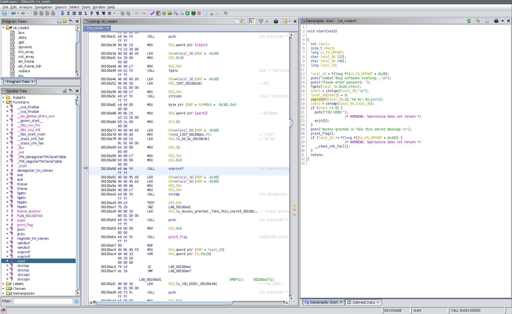
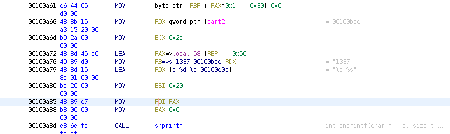

# Combat Ship Reversing Exercise 4: Understanding Calling Conventions

In this class of Combat Ship Reverse Engineering, you will learn about 
registers and calling conventions. With this information, you get better 
understanding of how function calls are made in the Assembly language.

This time, we will mostly look at the assembly window in Ghidra, but we will 
also compare with the window containing decompiled code. 

Your learning outcome will allow you to read assembly code to understand which
parameters are sent to a function, and then find the correct password for the 
Combat Ship Systems.

## Registers
It is good to know what registers are in order to learn about calling
conventions. Knowing about registers is also good knowledge for understanding
common reverse engineering and also binary exploitation. Registers are basic
knowledge for low level programming. These are explained in the [Starship
Shellcoding Programme](link.til.tutorial.her).

## Calling Conventions
A calling convention describes how parameters are passed to functions. To dive
a little deeper, it describes how to interpret the assembly code and in which 
registers the parameters should be stored, in order to execute functions. 
The most common calling convention, and the 
calling convention we describe and use in our tutorial is the AMD x86_64 
convention.

In this convention, the registers RDI, RSI, RDX, RCX and R8 are very 
interesting for us. The thing is, these registers stores the parameters
the functions use when they are executed. This is explained in a simple manner
in the [Starship Shellcoding Programme](link.til.tutorial.her). 

## Let's do some reversing!
In comparison with the other reverse engineering tutorial challenges, we do not
receive a binary file as part of the task. This time, we only receive a snippet
of assembly code. You see, Ghidra is a little too helpful for you to learn the
awesomeness of assembly. 

However, we provide you a binary file for this tutorial to play with. We believe
it will help you understand calling conventions good enough to be able to read 
the assembly and pass the exam!

Ok. Phew. Time for some reversing! Take the following binary file:

* [Combat Ship Reversing Exam 4 binary](./uploads/noob_4)

Open the file in Ghidra or IDA, and go to the `start()` function. If you've 
forgotten how to do this, please read the [introduction](link.her)
tutorial page. 



Take a look at the decompiled code in the right window. It is shown in the picture
above. We see that the program does the following: 
1. Line 13-14: Prints two lines of text
2. Line 15: Uses `fgets()` to read data from the terminal, and stores it in the
variable `local_38`.
3. Line 16-17: Uses `strcspn()` to find the length of the input excluding the 
new line at the end of the input string. Replaces the new line (`\n`) with a 
zero byte.
5. Line 18: Uses `snprintf()` to construct a string which is stored in 
`local_58`. 
6. Line 19: Uses `strcmp()` to compare the two variables. 
7. Line 20-24: Exits program if the variables are _not_ the same. 
8. Line 25-26: Prints message and calls the `print_flag()` function. 

The interesting part for us is the `snprintf()` function. It is the function
that constructs the string used to compare with our password. If we figure out
the constructed string, we know the password! Using your reversing skills from
the previous tutorial pages, you know how to do this using Ghidra. But
what if you don't get to see the decompiled code? That you only get to see the 
assembly code? What should you do then? 

Press the `snprintf()` function in Ghidra. This makes the middle window jump to
the assembly code of the function. Now your screen should look approximately
like in the picture above. With the knowledge about calling conventions
from the [Starship Shellcoding Programme](link.til.tutorial.her), we can tell
which registers contains the parameters of the function. Do you remember? The 
first parameter is stored in RDI, then the next parameter is stored in
RSI, next in RDX, then RCX, and so on. 

So there are mainly two steps to find the password:

1. Figure out how many parameters `snprintf()` has, and what the parameters are.
Check the man page, `man snprintf`, or google it.
2. Check what the registers for the interesting parameters contain.

So let's get started! Execute `man snprintf` in the terminal. You will get the
following output: 
```
PRINTF(3)                    Linux Programmer's Manual                   PRINTF(3)

NAME
       printf,  fprintf,  dprintf, sprintf, snprintf, vprintf, vfprintf, vdprintf,
       vsprintf, vsnprintf - formatted output conversion

SYNOPSIS
       #include <stdio.h>

       int printf(const char *format, ...);
       int fprintf(FILE *stream, const char *format, ...);
       int dprintf(int fd, const char *format, ...);
       int sprintf(char *str, const char *format, ...);
       int snprintf(char *str, size_t size, const char *format, ...);

       #include <stdarg.h>

       int vprintf(const char *format, va_list ap);
       int vfprintf(FILE *stream, const char *format, va_list ap);
       int vdprintf(int fd, const char *format, va_list ap);
       int vsprintf(char *str, const char *format, va_list ap);
       int vsnprintf(char *str, size_t size, const char *format, va_list ap);

   Feature Test Macro Requirements for glibc (see feature_test_macros(7)):

       snprintf(), vsnprintf():
           _XOPEN_SOURCE >= 500 || _ISOC99_SOURCE ||
               || /* Glibc versions <= 2.19: */ _BSD_SOURCE

       dprintf(), vdprintf():
           Since glibc 2.10:
               _POSIX_C_SOURCE >= 200809L
           Before glibc 2.10:
               _GNU_SOURCE

DESCRIPTION
       The functions in the printf() family produce output according to  a  format
       as  described  below.  The functions printf() and vprintf() write output to
       stdout, the standard output stream; fprintf() and vfprintf()  write  output
       to   the   given  output  stream;  sprintf(),  snprintf(),  vsprintf()  and
       vsnprintf() write to the character string str.

       The function dprintf() is the same as fprintf() except that it outputs to a
       file descriptor, fd, instead of to a stdio stream.

       The  functions snprintf() and vsnprintf() write at most size bytes (includ‐
       ing the terminating null byte ('\0')) to str.

       The functions vprintf(), vfprintf(),  vdprintf(),  vsprintf(),  vsnprintf()
       are  equivalent to the functions printf(), fprintf(), dprintf(), sprintf(),
       snprintf(), respectively, except  that  they  are  called  with  a  va_list
       instead of a variable number of arguments.  These functions do not call the
       va_end macro.  Because they invoke the va_arg macro, the  value  of  ap  is
       undefined after the call.  See stdarg(3).

       All  of  these  functions  write  the  output under the control of a format
       string that specifies how subsequent arguments (or arguments  accessed  via
       the  variable-length  argument  facilities  of stdarg(3)) are converted for
       output.

       C99 and POSIX.1-2001 specify that the results are undefined if  a  call  to
       sprintf(),  snprintf(),  vsprintf(),  or vsnprintf() would cause copying to
       take place between objects that overlap (e.g., if the target  string  array
       and  one  of  the  supplied input arguments refer to the same buffer).  See
       NOTES.
```

We see that `snprintf()` has _at least_ three parameters. There
may be more, which we can see because the end of the function calls has three
dots:
```
int snprintf(char *str, size_t size, const char *format, ...);
```

As a summary, the first parameter `str` is a string pointer, the variable we 
store the output of the function in. The second parameter `size` is the max 
amount of bytes 
that the function writes to `str`. The third parameter `format` is a string
pointer of the format that the output string should be stored as. Next is the
optional parameters. These optional parameters are added if the format string
requires input. The format string is quite hard to explain, so let's look at 
the man page once again and read a little further:
```
Format of the format string
       The format string is a character string, beginning and ending in  its  ini‐
       tial  shift  state,  if any.  The format string is composed of zero or more
       directives: ordinary characters (not %), which are copied unchanged to  the
       output  stream;  and  conversion  specifications,  each of which results in
       fetching zero or more subsequent arguments.  Each conversion  specification
       is introduced by the character %, and ends with a conversion specifier.  In
       between there may be (in this order) zero or more flags, an optional  mini‐
       mum field width, an optional precision and an optional length modifier.

       The arguments must correspond properly (after type promotion) with the con‐
       version specifier.  By default, the arguments are used in the order  given,
       where  each  '*'  (see Field width and Precision below) and each conversion
       specifier asks for the next argument (and it is an error if  insufficiently
       many  arguments are given).  One can also specify explicitly which argument
       is taken, at each place where an argument is  required,  by  writing  "%m$"
       instead  of  '%'  and  "*m$"  instead  of  '*', where the decimal integer m
       denotes the position in the argument list of the desired argument,  indexed
       starting from 1.  Thus,

           printf("%*d", width, num);

       and

           printf("%2$*1$d", width, num);

       are  equivalent.   The  second style allows repeated references to the same
       argument.  The C99 standard does not include the  style  using  '$',  which
       comes  from the Single UNIX Specification.  If the style using '$' is used,
       it must be used throughout for all conversions taking an argument  and  all
       width and precision arguments, but it may be mixed with "%%" formats, which
       do not consume an argument.  There may be no gaps in the numbers  of  argu‐
       ments specified using '$'; for example, if arguments 1 and 3 are specified,
       argument 2 must also be specified somewhere in the format string.

       For some numeric conversions a radix character ("decimal point")  or  thou‐
       sands'  grouping  character  is used.  The actual character used depends on
       the LC_NUMERIC part of the locale.  (See setlocale(3).)  The  POSIX  locale
       uses '.' as radix character, and does not have a grouping character.  Thus,

               printf("%'.2f", 1234567.89);

       results  in  "1234567.89" in the POSIX locale, in "1234567,89" in the nl_NL
       locale, and in "1.234.567,89" in the da_DK locale.
```

If we give it a try to say this in a short and sweet manner, we could say that 
a format string is a string that may contain text and format input. The format
input is represented by "%" and some characters. These two together tells the 
program what kind of input it should expect, and how to construct it. As 
examples, `%d` is the format string for numbers, while `%s` is for strings. 
For hexadecimals, you may use `%x`. Let's use the `printf()` function as an 
example like in the man page. In the following snippet, you see that there is
a string containing a `%d`. This means that it expects to be replaced with the
number that is added as a parameter. In this case, the parameter is the variable
`num`. 
```
printf("My number: %d", num);
```

We just learned the parameters of the `snprintf()` function. Now, let's try to
read the assembly code. You may look at the image below. 



Look at the memory address `0x00100a79`! That is the format string! We can see
it immediately by looking at the string on the right side, `= "%d %s"`. We can 
also double check by making sure it is inserted into the register for the 
third parameter. It certainly is, as it is loaded into RDX! Nice, then we also
know all of the parameters we need to look for. Let's make an overview to not
get confused: 

| mnemonic | description  |
|----------|--------------|
| RDI      | Output variable. RDI points to the `local_58` variable. At the memory address `0x00100a85` we  see that RAX is moved into RDI. A little further up, at `0x00100a72`, we see  that the program uses the LEA mnemonic to make RAX point to the local variable at `RBP + -0x50`. It is common to find local variables using its offset from rbp.   |
| RSI      | Max size written to output variable. RSI contains `0x20`, which is the hexadecimal representation of the number 32.  We see that at the memory address `0x00100a80`, where 0x20 is moved into ESI. Remember that ESI is the same as RSI, but it only has room for 32 bit.   |
| RDX      | Format string. RDX contains the format string as explained above. We can find it at the memory address `0x0100a79`.  |
| RCX      | First variable to put into format string. Must be of type 'decimal integer'.  RCX contains `0x2a` as we can see in the memory address `0x00100a6d`. In decimal 0x2a is 42. Same as for the max size, the 32 bit register is used in  stead of the 64 bit register. Both are stored in the 32 bit registers because they are 32 bit.   |
| R8       | Second variable to put into format string. Must be of type 'string'.  R8 contains the text string "1337" as seen at memory address `0x00100a76`. We can see that the contents of the RDX register is moved into R8. At the memory address `0x00100a66`, a qword pointer was moved into RDX. We can tell that this pointer is the text "1337" because Ghidra helps us with the useful comments on the left side. |

Okey. So I hope this was not just a bunch of jibber jabber to you. Do you
remember how the format string works? We have the format string `"%d %s"`,
and the parameters `42`, and `"1337"`. Let us fulfill the `snprintf()` call by
looking at the man pages: 
```
int snprintf(char *str, size_t size, const char *format, ...);
...
int snprintf(local_58, 32, "%d %s", 42, "1337");
```

Get it now? The password will now become the output of `snprintf()` which is 
`42 1337`. Note the whitespace between the numbers!

Run the binary and check it out!
```
$ ./re_noob4
Combat Ship software starting...

Please enter password:
42 1337
Access granted.
 Take this secret message:

TG20{placeholder flag}
```

Awesome! Great work! You are now ready for the last exam to fight against the 
reckless group eliminating people on our spaceship!

## Summary 
In this class, you have learned what registers and calling conventions
are. You should understand how the AMD x86_64 calling works, and be able to look
at assembly code and understand which parameters are put into a function. 

You should have sufficient knowledge to be able to solve the following 
reverse engineering challenge:

* [Combat Ship Reversing Exam 4](link.til.oppgave)
